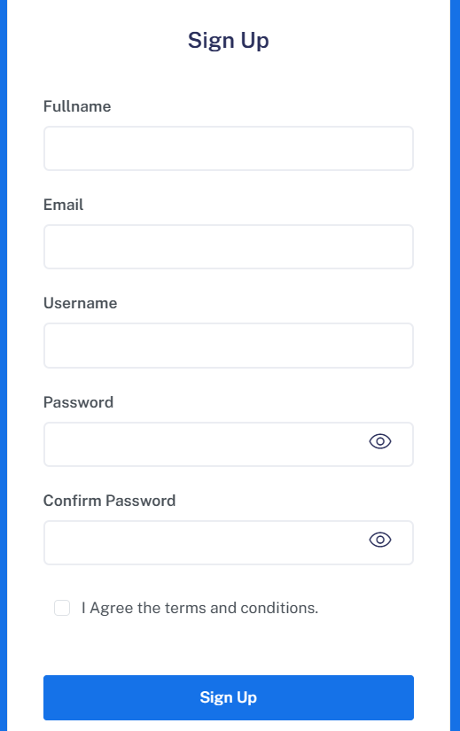
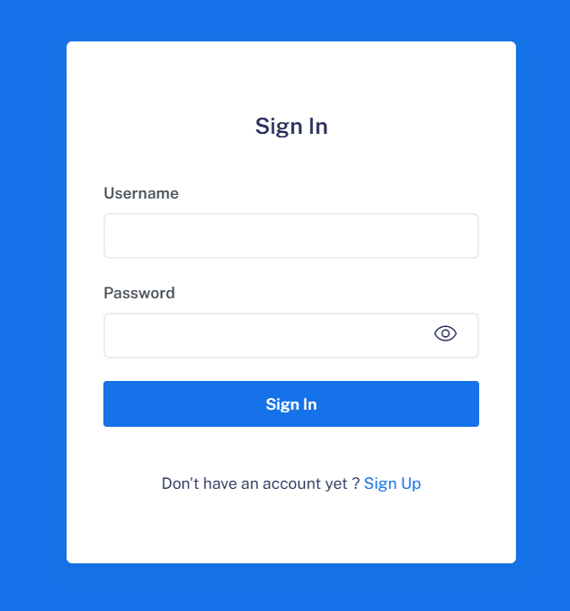
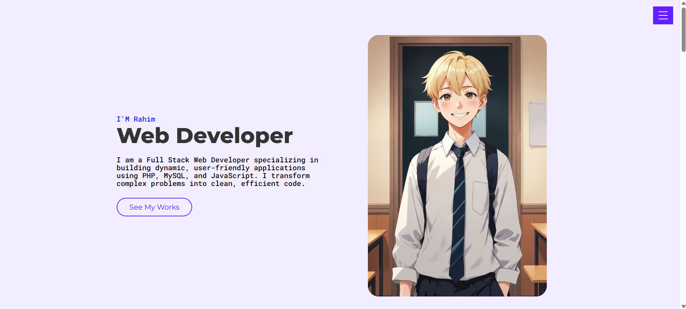
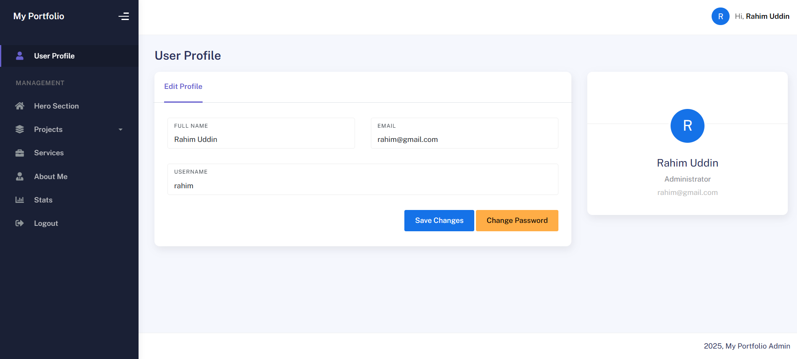
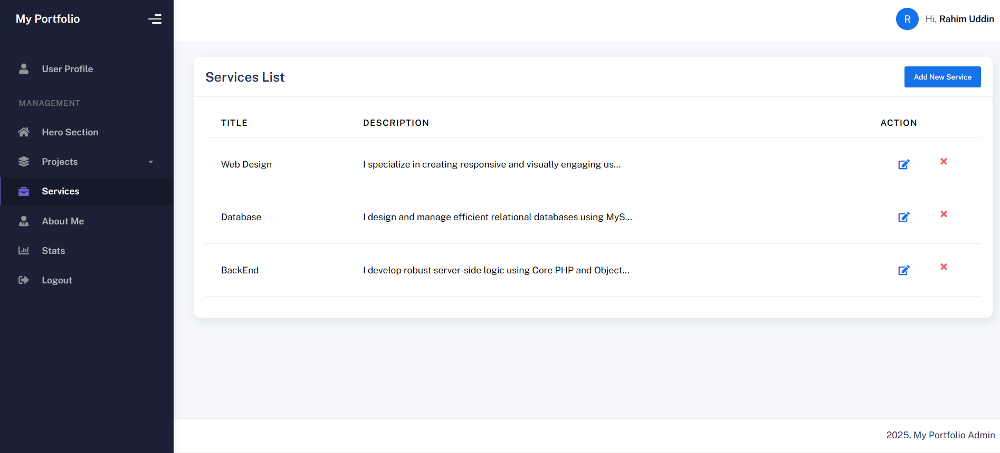

# Dynamic Portfolio CMS

A fully functional **Content Management System (CMS)** built with **Core PHP** and **MySQL**. This application allows users to manage their personal portfolio content—including projects, services, and bio—dynamically through a secure Admin Dashboard without touching the source code.

## 🚀 Features

### 🔒 Authentication & Security
* **Secure Login & Registration:** User authentication system with password hashing.
* **Session Management:** Protected admin routes that require login credentials.
* **Password Reset:** Functionality to securely update user passwords.

### 🛠 Admin Dashboard (CMS)
* **Hero Section Manager:** Update the main headline, description, and profile image dynamically.
* **Project Management (CRUD):**
    * Add new projects with titles, tech stacks, descriptions, and preview URLs.
    * Upload project thumbnails/images.
    * Edit or Delete existing projects.
* **Service Management:** Add, edit, or remove services.
* **Stats Management:** Update dynamic counters (e.g., "Projects Completed").
* **About Me & Resume:** Update biography text and manage resume links.
* **Profile Settings:** Update admin name, email, and username.

### 🎨 Public Frontend
* **Dynamic Rendering:** All content on `index.php` is fetched in real-time from the MySQL database.
* **Responsive Design:** Built with Bootstrap and custom CSS for mobile-friendly layouts.
* **Interactive UI:** Includes a contact footer, smooth scrolling, and project grids.

## 📸 Screenshots

| Registration | Login | 
| :---: | :---: |
|  |  |

| Public Frontend | Admin Dashboard |
| :---: | :---: |
|  |  |

| Service Management | Hero Section |
| :---: | :---: |
|  |  |

## 💻 Tech Stack

* **Backend:** PHP (Core), MySQL
* **Frontend:** HTML5, CSS3, JavaScript
* **Frameworks/Libraries:**
    * [Bootstrap 5](https://getbootstrap.com/) (Layout)
    * KaiAdmin (Admin Dashboard Template)
    * FontAwesome (Icons)
    * Google Fonts (Montserrat & Roboto Mono)

## ⚙️ Installation & Setup

1.  **Clone the Repository**
    ```bash
    git clone [https://github.com/yourusername/dynamic-portfolio-cms.git](https://github.com/yourusername/dynamic-portfolio-cms.git)
    cd dynamic-portfolio-cms
    ```

2.  **Database Configuration**
    * Create a MySQL database (e.g., `portfolio_db`).
    * Import the provided `.sql` file.
    * Configure the connection in `config/database.php`:
    ```php
    $conn = new mysqli('localhost', 'root', '', 'portfolio_db');
    ```

3.  **Run the Project**
    * Place the project folder in your local server directory (e.g., `htdocs` for XAMPP).
    * Open your browser and navigate to:
        * **Frontend:** `http://localhost/dynamic-portfolio-cms/index.php`
        * **Admin:** `http://localhost/dynamic-portfolio-cms/admin/login.php`
